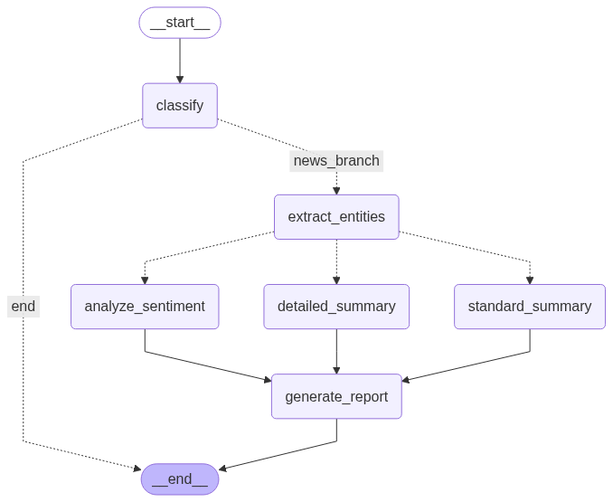

# Text Analysis Pipeline with LangGraph

This project implements a sophisticated, stateful text processing workflow using LangGraph. The agent acts as an intelligent pipeline that analyzes a piece of text, classifies it, and routes it through different processing paths based on its category. It demonstrates the power of conditional routing in LangGraph to create dynamic, adaptable AI systems.

The final output is a consolidated, human-readable report summarizing all the analysis performed.



## Key Features

-   **Dynamic Classification**: Automatically categorizes input text into `News`, `Blog`, `Research`, or `Other`.
-   **Conditional Routing**: The agent's execution path changes based on the text's classification. This is the core "decision-making" capability of the agent.
-   **Specialized Processing Nodes**:
    -   **Research Papers**: Receive a detailed, multi-point summary focusing on methodology and findings.
    -   **Blog Posts**: Undergo sentiment analysis (Positive, Negative, Neutral).
    -   **News Articles**: Get a standard, concise one-sentence summary.
-   **Structured Entity Extraction**: Uses Pydantic and LangChain's `JsonOutputParser` to reliably extract named entities (People, Organizations, Locations) in a structured JSON format.
-   **Automated Reporting**: All processing paths converge to a final node that assembles a clean, markdown-formatted report.
-   **Graph Visualization**: The script automatically generates a PNG image of the workflow graph, making the agent's logic easy to visualize and understand.

## Architecture & Workflow

The agent is built as a state machine using `StateGraph`. The state (`GraphState`) is a dictionary that is passed between nodes, with each node reading from and writing to it.

1.  **Input**: The process starts with a block of raw text.
2.  **`classify` Node**: The LLM classifies the text into a category.
3.  **Conditional Edge `decide_path`**: Based on the classification, the graph decides the next step.
    -   If `Research`, `Blog`, or `News`, it proceeds to entity extraction.
    -   If `Other`, the graph terminates.
4.  **`extract_entities` Node**: A common step that uses a Pydantic model to extract all named entities from the text.
5.  **Conditional Edge `route_after_entities`**: A second decision point routes the flow based on the original classification.
    -   A `Research` text is sent for `detailed_summary`.
    -   A `Blog` text is sent for `analyze_sentiment`.
    -   A `News` text is sent for `standard_summary`.
6.  **Task Execution**: The appropriate specialized node is executed.
7.  **`generate_report` Node**: All active paths converge here. This node gathers all the information collected in the state and formats it into the final report.
8.  **END**: The process completes, returning the final state which includes the report.

## Technology Stack

-   **Orchestration**: LangGraph
-   **LLM Provider**: Groq (for high-speed inference with Gemma 2)
-   **LLM Interactions**: LangChain (Chains, Prompts)
-   **Data Validation & Parsing**: Pydantic & `JsonOutputParser`
-   **Environment Management**: `python-dotenv`
-   **Core Language**: Python 3.9+

## Local Setup & Execution

### 1. Prerequisites
-   Python 3.9+
-   Access to the parent directory of this project.

### 2. Installation
*This assumes you have already set up a virtual environment in the parent directory.*

Install the dependencies:
```bash
uv add -r requirements.txt
```

### 3. Environment Variables
Ensure you have a `.env` file in the root of the parent project folder with your Groq API key:
```
GROQ_API_KEY="gsk_YourSecretGroqApiKey"
```

### 4. Run the Pipeline
Execute the main script from your terminal (make sure you are in the parent `ai_agent_project` directory):
```bash
python text_analysis_pipeline/text_analysis_pipeline.py
```

The script will run three different test cases (Research, Blog, and News) and print the final report for each to the console. It will also generate the `workflow_graph.png` file inside this directory.

## Example Output (Blog Post)

```markdown
## Text Analysis Report

**1. Classification:**
Blog

**2. Extracted Entities:**
- PixelPro 10
- Google
- Mountain View

**3. Sentiment Analysis:**
The sentiment of the text is **Positive**.
```